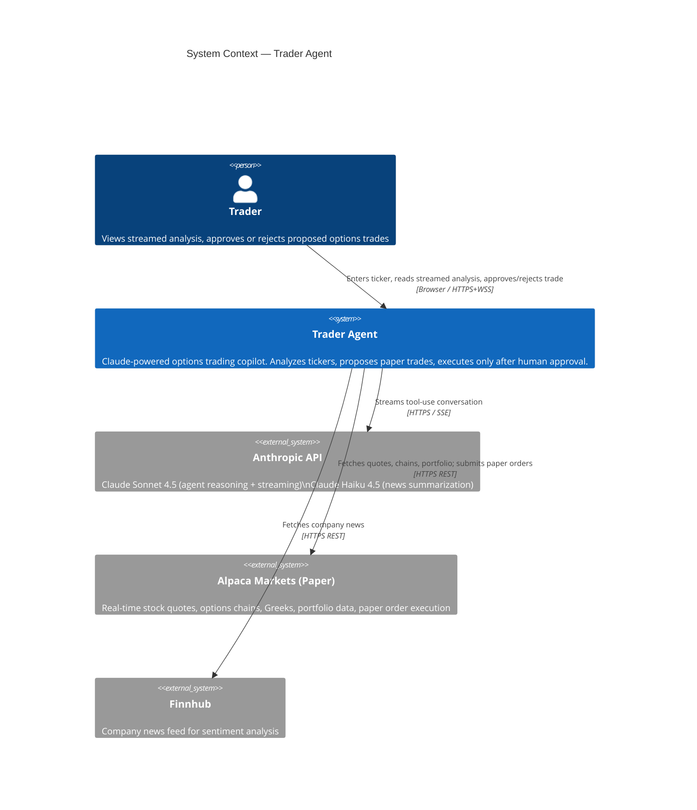
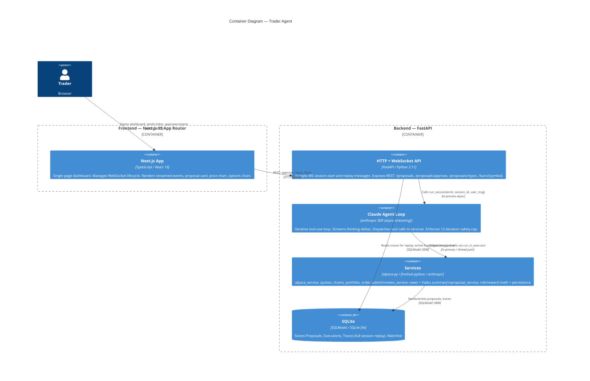
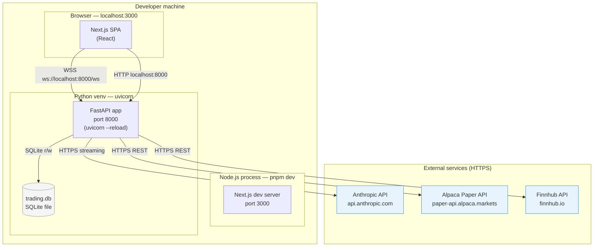
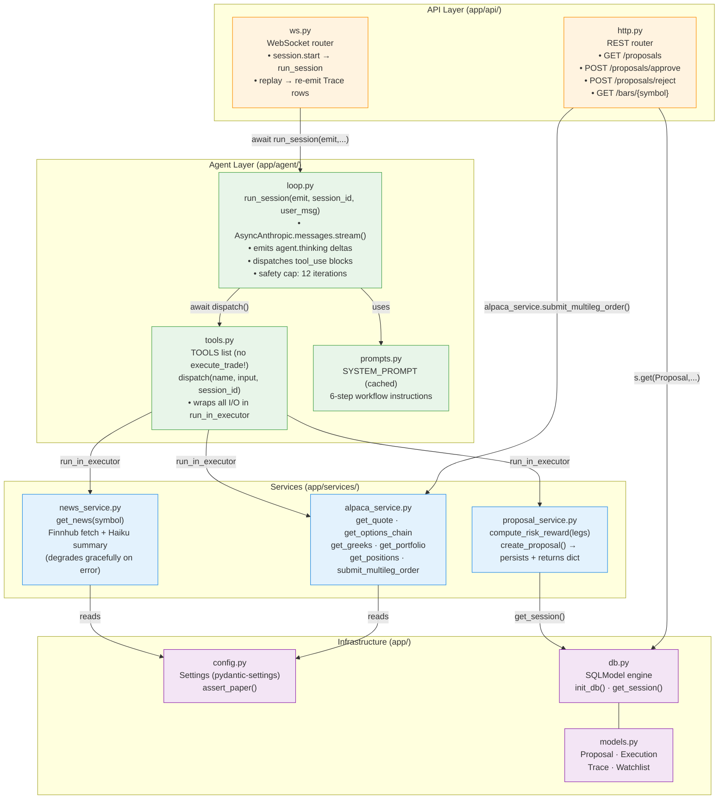
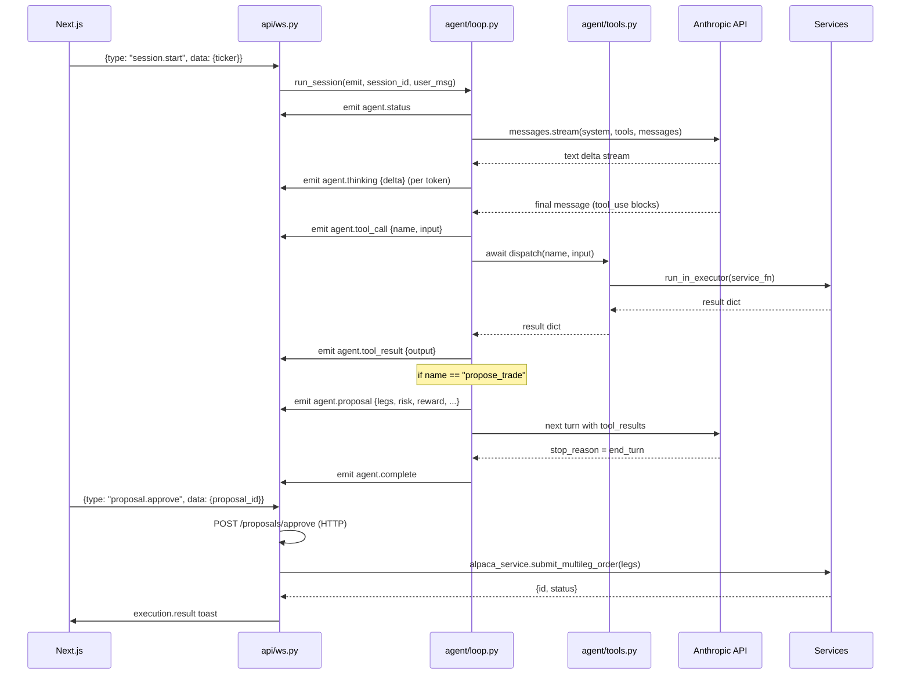
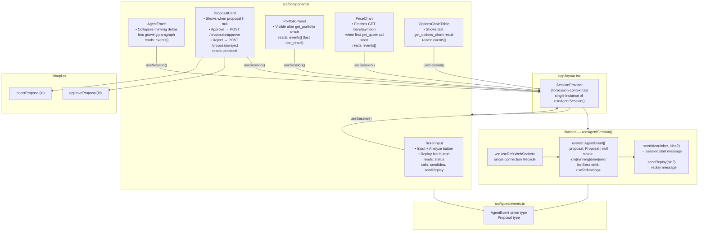
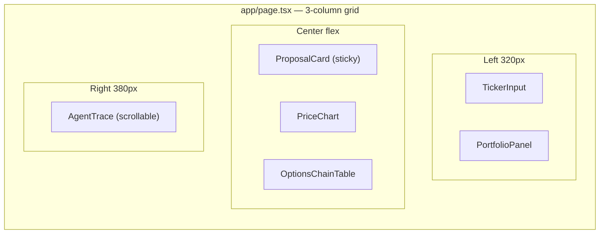
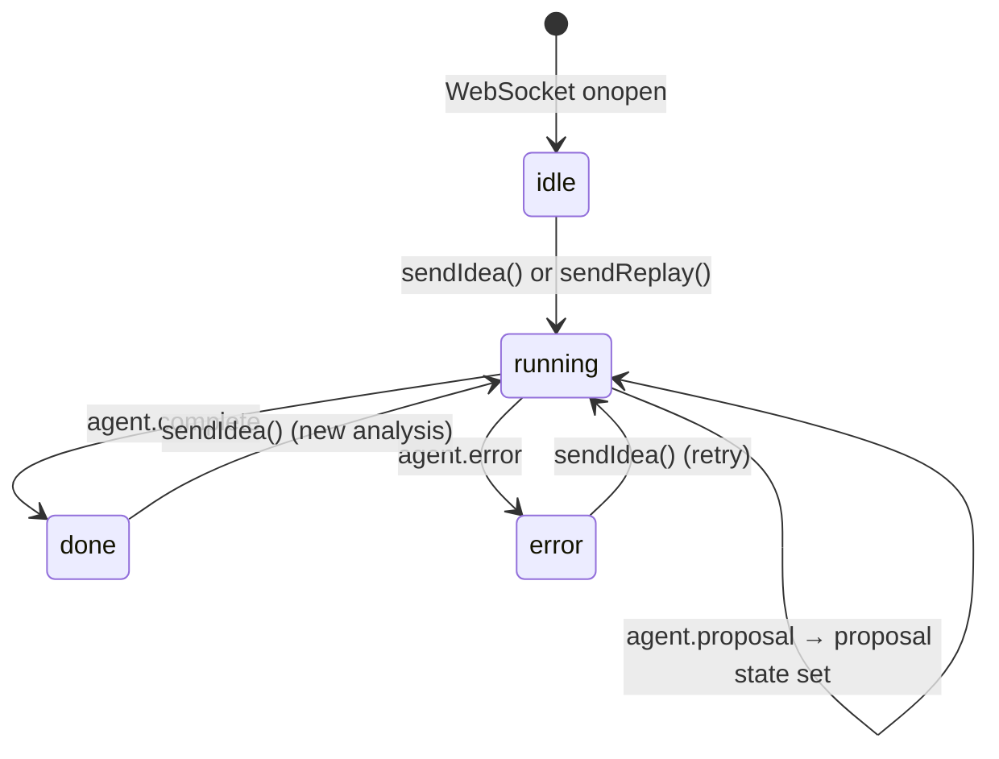
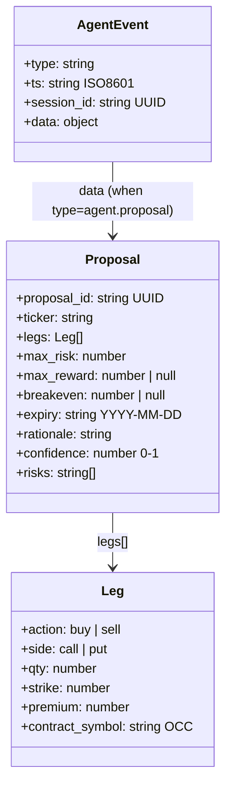

# Architecture Documentation — Trader Agent

> Diagrams rendered with [Mermaid](https://mermaid.js.org/). All diagrams follow the [C4 model](https://c4model.com/) levels where applicable.

---

## 1. Context Diagram (C4 Level 1)

Who uses the system and what external services does it depend on.

---

## 2. Container Diagram (C4 Level 2)

The two runnable processes and their communication.

---

## 3. Deployment Diagram

How the system runs locally (hackathon setup) and the network topology.

**Startup safety check:** FastAPI refuses to boot if `ALPACA_BASE_URL` does not contain `"paper"`.

**Fixtures mode:** Set `FIXTURES_MODE=1` to skip all external HTTP calls. Every service returns canned data from `backend/tests/fixtures/`. Enables fully offline demos.

---

## 4. Backend Micro-Design

Internal module responsibilities and call flow.

### Agent loop sequence

---

## 5. Frontend Micro-Design

Component tree, state ownership, and data flow.

### Page layout (3-column desktop)

### WebSocket event flow (frontend perspective)

---

## Event Schema Reference

---

*Generated from source — last updated with commit `8f9b1b4`.*
